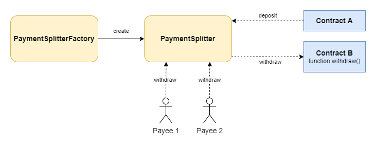

# Payment Splitter Factory

Factory contract to create instances of **PaymentSplitter** the contract.
The _PaymentSplitter_ contract is an adaptation of the [OpenZeppelin verion](https://github.com/OpenZeppelin/openzeppelin-contracts/blob/master/contracts/finance/PaymentSplitter.sol). This version does not include support for ERC20 tokens and adds the capability to withdraw REEF from a third party contract that requires the caller to be the recipient address of the available balance.

<p align="center">
	
</p>

This project has been created using the [Hardhat-reef-template](https://github.com/reef-defi/hardhat-reef-template).

## Contract addresses

Mainnet:
[0x0](https://reefscan.com/contract/0x0)

Testnet: [0x5c6713098D692399D5eecb6Ef54c69E60512fcbF](https://testnet.reefscan.com/contract/0x5c6713098D692399D5eecb6Ef54c69E60512fcbF)

## Installing

Install all dependencies with `yarn`.

## Compile contract

```bash
yarn compile
```

## Deploy contracts

Deploy in testnet:

```bash
yarn deploy:testnet
```

Deploy in mainnet:

```bash
yarn deploy:mainnet
```

## Run tests

Local network:

```bash
yarn test
```

Testnet:

```bash
yarn test:testnet
```

## Use account seeds

In order to use your Reef account to deploy the contracts or run the tests, you have to rename the _.env.example_ file to _.env_ and set your seed words there.

## License

Distributed under the MIT License. See [LICENSE](LICENSE) for more information.
